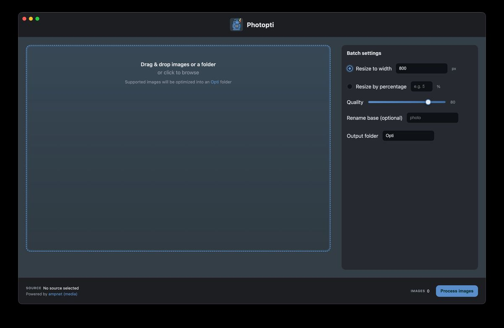
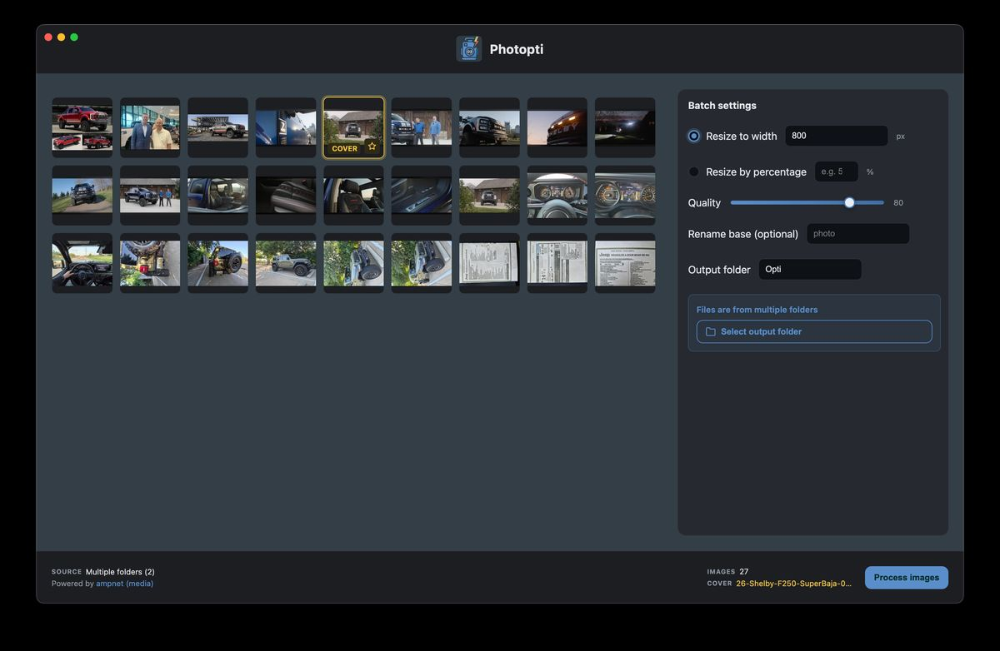
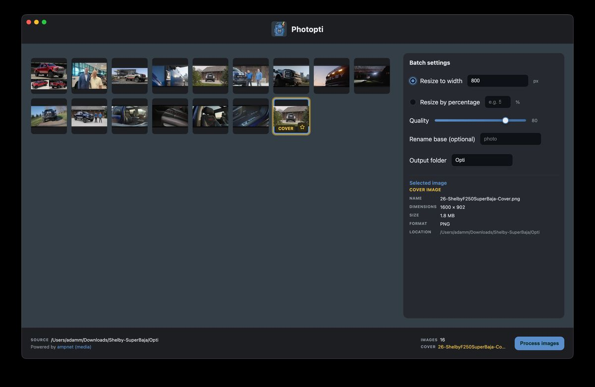
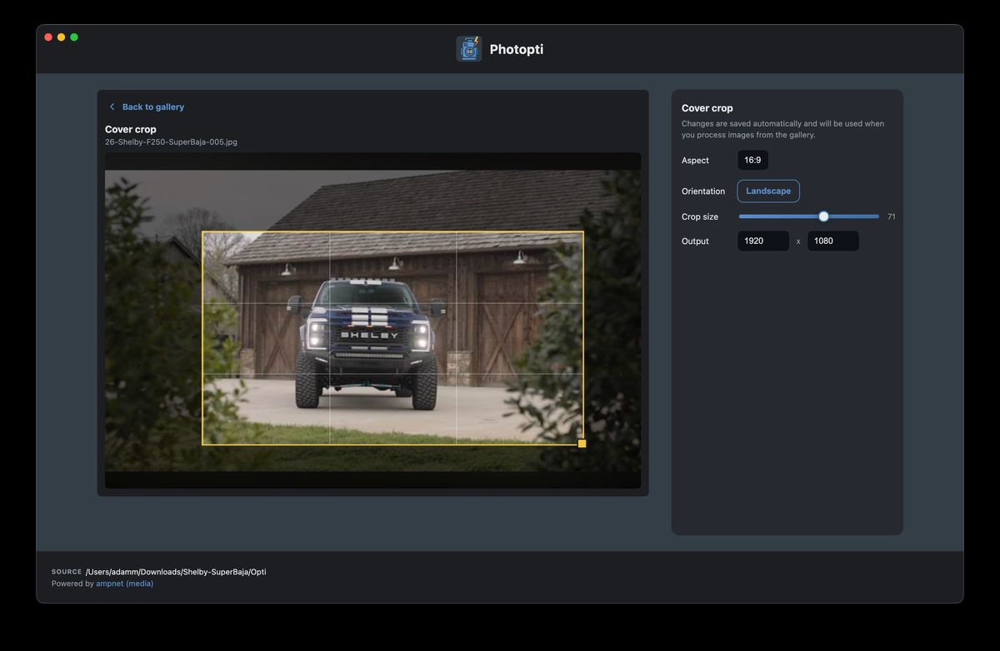

# Photopti

Photopti is a local-first desktop app for photographers, designers, and web teams who need to resize and compress batches of images without uploading them to a service. It also creates a precisely cropped cover image alongside the batch output.

## Screenshots

### Start with drag and drop

Drop files or a folder into the workspace, or click to browse. Batch settings stay visible on the right so width, quality, rename base, and output folder are ready before processing begins.



### Review a large gallery

Imported images appear as a scrollable thumbnail grid. The sidebar stays fixed while you browse, and the footer tracks how many images are loaded. When files come from more than one folder, Photopti prompts you to choose a shared output location.



### Inspect a selected image

Click any thumbnail to see its metadata in the sidebar: filename, dimensions, file size, format, and source location. If that image is the cover, the panel labels it accordingly so you can confirm the hero asset before processing.



### Crop a dedicated cover image

Promote one image to cover and switch into the crop workspace. Adjust aspect ratio, orientation, crop size, and output dimensions on a live preview. Changes are saved automatically and used when you process the batch from the gallery.



## What it does

- Select image files or recursively discover images in a folder.
- Resize by a target width or percentage and choose JPEG quality.
- Optionally rename output files with a numbered sequence.
- Review thumbnails, remove items, and designate one image as a cover.
- Crop a cover to 16:9, 1:1, 4:3, or a free aspect ratio in landscape or portrait orientation.
- Cancel a running batch and review file-level failures.

Photopti accepts PNG, JPEG, WebP, GIF, TIFF, BMP, AVIF, HEIC, and HEIF input. Output is JPEG. Animated inputs are not preserved as animations.

All processing happens on the local computer. Source files are never modified. By default, results are written to an `Opti/` directory beside the selected folder or files; the output directory name can be changed. When selected files span multiple directories, the app asks for an output location. Existing output names are preserved and new files receive a numeric suffix instead of being overwritten.

## Install a release

Download the artifact for your operating system from [GitHub Releases](https://github.com/adamaoc/photopti-app/releases). Builds are configured for macOS (`.dmg` and `.zip`), Windows (`.exe` and `.zip`), and Linux (`.AppImage`, `.deb`, and `.tar.gz`). Availability depends on the artifacts published for each release; platform builds have not yet been verified on every supported operating system.

Current releases may be unsigned. On macOS, Gatekeeper may block an unsigned build: open it with Control-click **Open** and confirm only if it came from this repository. Windows may display a SmartScreen warning. Official releases should be signed and, on macOS, notarized before broad distribution.

## Develop locally

Prerequisites:

- Node.js 20 or 22 and npm
- Git
- Platform build tools if a native dependency cannot use a prebuilt binary

From a fresh clone:

```bash
git clone https://github.com/adamaoc/photopti-app.git
cd photopti-app
npm ci
npm start
```

There is no hot reload. Reload renderer-only changes from Electron, and restart the process for main-process or preload changes.

Run the complete automated check:

```bash
npm run check
```

This performs a JavaScript syntax check and runs the Node test suite. The tests cover discovery, dialogs, thumbnails, batch processing, cancellation, error summaries, gallery behavior, crop geometry, and generated cover dimensions.

## Build packages

Build on the target operating system when possible:

```bash
npm run dist:mac
npm run dist:win
npm run dist:linux
```

`npm run dist` requests all configured targets and is intended for a properly provisioned release environment. Artifacts are written to `dist/`, which is ignored by Git. Cross-platform packaging can require additional host tools and does not replace testing on the target platform.

Signing credentials must be supplied through the environment and must never be committed. The macOS notarization hook accepts either `APPLE_ID`, `APPLE_APP_SPECIFIC_PASSWORD`, and `APPLE_TEAM_ID`, or the App Store Connect API variables `APPLE_API_KEY`, `APPLE_API_KEY_ID`, and `APPLE_API_ISSUER`. See [the release checklist](docs/RELEASE_CHECKLIST.md) for the full process.

## Project structure

```text
main.js                 Electron lifecycle entry point
main-process/           Windows, IPC, discovery, thumbnails, and processing
preload.js              Restricted renderer-to-main bridge
renderer/               HTML, CSS, UI behavior, and crop geometry
assets/                 Application logo, platform icons, and demo screenshots
build/                  Packaging entitlements and notarization hook
scripts/                Repository checks
test/                   Node test suite
docs/                   Maintainer documentation
```

## Status and limitations

Photopti is usable but is preparing for its first broadly supported public release. Processing is sequential, folder discovery is capped at 10,000 files and 12 directory levels, and output is always JPEG. Metadata and animation are not intentionally preserved. Automated tests do not replace hands-on testing of packaged builds or every source codec on macOS, Windows, and Linux.

## Contributing and support

Read [CONTRIBUTING.md](CONTRIBUTING.md) before submitting a change. Use the issue templates to [report a bug](https://github.com/adamaoc/photopti-app/issues/new/choose) or request a feature. Report vulnerabilities privately as described in [SECURITY.md](SECURITY.md).

Photopti is available under the [MIT License](LICENSE). It is built with [Electron](https://www.electronjs.org/), [Sharp](https://sharp.pixelplumbing.com/), and [heic-convert](https://github.com/catdad-experiments/heic-convert). The Photopti name, logo, and icon assets are maintained as project-owned assets and are not granted for unrelated branding by the MIT license covering the source code.
